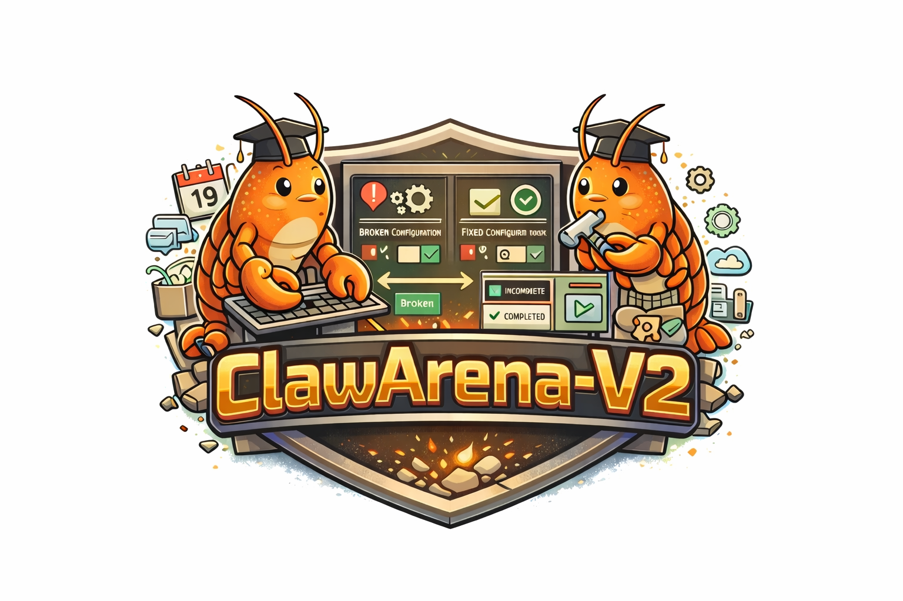
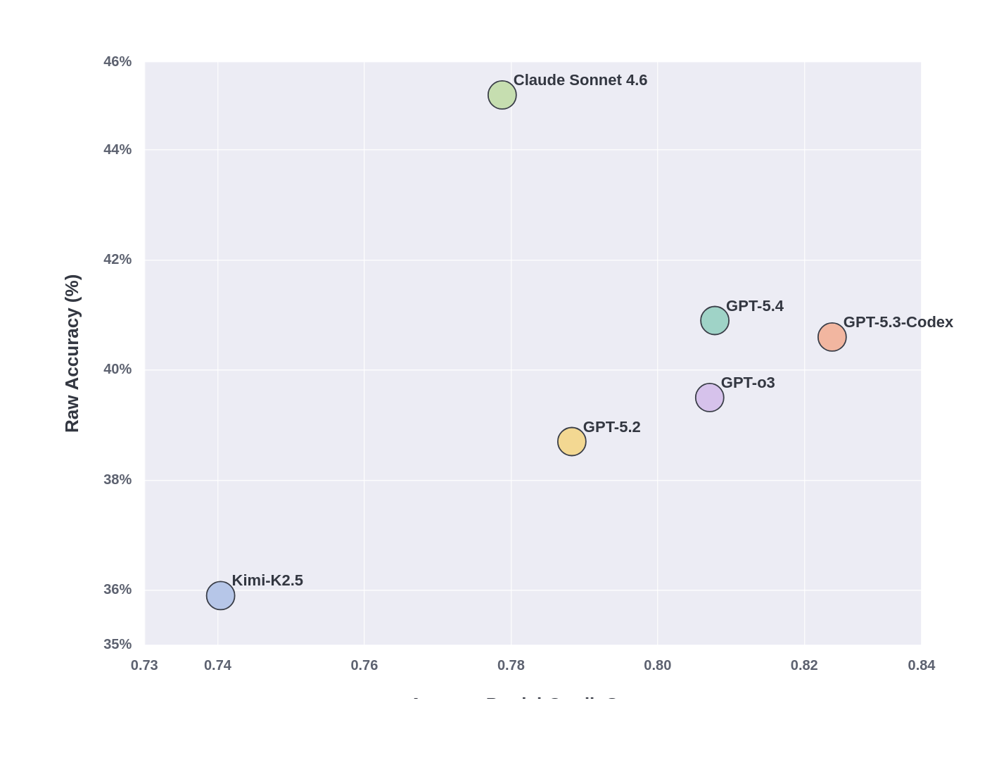

<p align="center">
  
</p>

# Benchmarking AI agents in interactive execution environments

ClawArena-V2 is an interactive benchmark for CLI-style agents. Instead of scoring a final text answer, it evaluates whether an agent can inspect persistent state, issue commands step by step, and complete workflows through real state changes and observable side effects.

[](https://www.python.org/downloads/)
[](https://opensource.org/licenses/MIT)
[](docs/hard-benchmark.md)
[](docs/hard-benchmark.md)
[](docs/hard-benchmark.md)
[](docs/execution-modes.md)

Overview • [Quick Start](#-quick-start) • [Hard Benchmark](#-hard-and-multi-step-decision-benchmark) • [Execution Modes](#-execution-modes) • [OpenClaw Setup](#-openclaw-setup) • [Running Evaluations](#-running-evaluations) • [Task Generation](#-task-generation) • [Docs Index](docs/README.md)

---

## 🔭 Overview

The flagship benchmark family is `hard_decision_workflow`, a hard interactive suite built around partial state, branching decisions, repair, replacement, duplicate avoidance, and workflow closure.

Current official release snapshot:

- `17` hard scenarios
- `362` hard tasks
- `1616` total tasks
- default split: `train 967 / dev 321 / test 328`

These are **release statistics**, not fixed generator limits. The benchmark is generated from parameterized scenario families, so users can regenerate larger or smaller snapshots by changing per-scenario counts while preserving task semantics and evaluator contracts.

For the benchmark overview and scenario taxonomy, see [Hard Benchmark Reference](docs/hard-benchmark.md).

---

## 🧭 Why OpenClaw-Env

ClawArena-V2 is built around three ideas:

- **Interactive execution**: agents act through explicit commands and must respond to evolving state.
- **Automated generation**: tasks are compiled from scenario templates, state initialization, reference trajectories, and executable validators.
- **Functional evaluation**: runs are scored by resulting state and side effects rather than exact action-sequence matching.

This design exposes failures that only appear during execution: duplicate work, stale-state mistakes, wrong updates, and incomplete closure.

<p align="center">
  
</p>

---

## 🚀 Quick Start

Install:

```bash
pip install -e .
pip install -e ".[dev]"
```

Generate tasks:

```bash
python scripts/generate_tasks.py
```

Run one hard-benchmark evaluation:

```bash
python examples/train_and_eval.py \
  --agent llm \
  --llm-provider openai \
  --llm-base-url https://api.example.com/v1 \
  --model Kimi-K2.5 \
  --task-prefix hard_decision_workflow_ \
  --split test \
  --mode multi \
  --max-steps 20 \
  --llm-max-tokens 192 \
  -v
```

For the full installation path, Bedrock Claude via LiteLLM, and additional first-run commands, see [Quick Start Guide](docs/quickstart.md).

---

## 🎯 Hard and Multi-Step Decision Benchmark

`hard_decision_workflow` asks whether an agent can inspect the current state, determine what is missing or stale, take the correct branch, and finish the workflow without duplicating valid existing work.

The current hard suite is organized around six recurring ability buckets:

- `duplicate_avoidance`
- `gap_completion`
- `information_transfer`
- `multi_source_reasoning`
- `state_repair`
- `workflow_completion`

For the full scenario inventory, generator slugs, and current official profile, see [Hard Benchmark Reference](docs/hard-benchmark.md).

---

## ⚙️ Execution Modes

The environment supports four execution modes:

- `mock`
- `multi`
- `real`
- `hybrid`

`multi` is the default benchmark mode because it preserves cross-surface interaction and interactive state while remaining reproducible and inexpensive to run.

For the exact behavior of each mode and the distinction between routing and provider realization, see [Execution Modes Guide](docs/execution-modes.md).

---

## 🛠️ OpenClaw Setup

`real` and `hybrid` mode require a working OpenClaw installation. `mock` and `multi` do not.

Typical setup tasks include:

- installing the `openclaw` CLI
- starting the gateway
- bootstrapping Google-backed providers for Calendar, Gmail, and Tasks
- exporting provider environment variables

See [OpenClaw Setup Guide](docs/openclaw-setup.md) for the full setup path.

---

## 📊 Running Evaluations

The primary evaluation entrypoint is:

```bash
python examples/train_and_eval.py
```

Useful outputs include:

- full-pass accuracy
- partial-credit average score
- scenario-level and ability-level summaries
- provider-aware accounting such as `provider_failures` and `provider_impacted_tasks`

For common commands, baseline agents, `--llm-history-mode`, and output interpretation, see [Evaluation Guide](docs/evaluation.md).

---

## 💻 Interactive Environment

The environment follows a simple loop: the agent receives one task instruction, emits one command per step, observes the resulting output and state, and continues until the workflow completes or the step budget is exhausted.

The benchmark evaluates end conditions and observable side effects rather than requiring one exact action trajectory. For environment behavior and benchmark semantics, see [Execution Modes Guide](docs/execution-modes.md) and [Hard Benchmark Reference](docs/hard-benchmark.md).

---

## 🏭 Task Generation

All generated outputs are written under `openclaw_env/data/{tasks,datasets}`.

The hard benchmark is generator-configurable. In particular, `hard_decision_workflow` supports both a shared base count and explicit per-scenario overrides, so the released `362`-task hard snapshot is one official subset rather than a hard-coded ceiling.

For generation flags, output layout, and coverage reports, see [Task Generation Guide](docs/task-generation.md).

---

## 📚 Hard Scenario Reference

The current official hard profile spans `17` scenario families covering release recovery, state repair, conflicting-source resolution, duplicate-aware closure, operations review, and inbox-style information transfer.

The paper-facing scenario names, generator slugs, and ability mapping are documented in [Hard Benchmark Reference](docs/hard-benchmark.md).

---

## 📋 Evaluation Framework

Tasks can combine several checker types:

- `state`
- `output`
- `config`
- `effect`
- optional `llm`

Metrics are reported through full-pass outcomes and partial-credit scores computed over the same evaluator configuration. For checker types and evaluation framing, see [Hard Benchmark Reference](docs/hard-benchmark.md) and [Evaluation Guide](docs/evaluation.md).

---

## 🗂️ Dataset Scope

The full benchmark spans single-domain tasks, compositional workflows, and the hard decision family.

Representative domains include calendar, email, weather, files, tasks, setup/config, messaging, agent management, monitoring, plugins, cron/webhooks, and cross-domain composite workflows.

---

## 🏗️ Project Structure

Core subsystems live under:

- `examples/`
- `openclaw_env/backend/`
- `openclaw_env/core/`
- `openclaw_env/data/`
- `openclaw_env/evaluation/`
- `openclaw_env/skills/`
- `openclaw_env/tasks/`
- `scripts/`
- `tests/`

For a concise repo map and subsystem guide, see [Project Structure Guide](docs/project-structure.md).

---

## 🧪 Running Tests

Typical targeted checks:

```bash
pytest -q tests/test_hard_decision_workflow_generator.py
pytest -q tests/test_train_and_eval_cli.py
```

For the broader development check list, see [Project Structure Guide](docs/project-structure.md).

---

## 🛡️ Safety

The environment applies:

- an allowlist for strict simulated backends
- a blocked-pattern filter for dangerous commands

`real` and `hybrid` disable the allowlist for real `openclaw` execution, but blocked patterns remain in force.

---

## 📈 Current Results Snapshot

The repository also includes a paper-derived snapshot of the current release results. Treat these as a documented release artifact, not as a live leaderboard that updates automatically with every code change.

<p align="center">
  
</p>

For the current interpretation notes, caveats, and the release-snapshot framing, see [Results Snapshot](docs/results.md).

---

## 🔗 Additional Resources

- [Documentation Index](docs/README.md)
- [Quick Start Guide](docs/quickstart.md)
- [Evaluation Guide](docs/evaluation.md)
- [Execution Modes Guide](docs/execution-modes.md)
- [OpenClaw Setup Guide](docs/openclaw-setup.md)
- [Task Generation Guide](docs/task-generation.md)
- [Hard Benchmark Reference](docs/hard-benchmark.md)
- [Results Snapshot](docs/results.md)
- [ClawArena-V2 Data and Scenario Overview](docs/v2-data-and-scenarios-explained.md)
- [Project Structure Guide](docs/project-structure.md)
- [ClawArena-V2 Integration Guide](docs/v2-integration-guide.md)
- [Hard split coverage report](openclaw_env/data/datasets/hard_split_coverage_report.json)
- [Generator coverage report](openclaw_env/data/datasets/generator_coverage_report.json)

---

## 📝 Citation

```bibtex
@misc{clawarena-v2-2026,
  title   = {ClawArena-V2: An Interactive Environment for Evaluating Command Line Agents on Hard Decision Workflows},
  year    = {2026},
  url     = {https://github.com/your-org/cli-agent-env}
}
```
