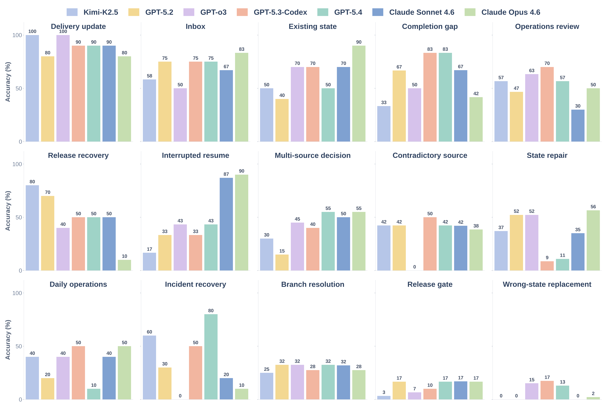

# Hard Benchmark Reference

Back to [README](../README.md) · See also [evaluation.md](evaluation.md) and [task-generation.md](task-generation.md)

## Overview

The flagship benchmark family is `hard_decision_workflow`, a hard interactive benchmark built around partial state, branching decisions, repair, replacement, and workflow closure.

Current official release snapshot:

- `17` scenarios
- `362` hard tasks
- default split: `train 967 / dev 321 / test 328`

These counts describe the current official release profile. They are generator-configurable rather than fixed benchmark limits.

The current release should be read as one official snapshot of the benchmark family, not as the benchmark's upper bound. Scenario counts can be changed without changing the underlying scenario semantics, task schema, or evaluator contract.

## Primary ability buckets

- `duplicate_avoidance`: confirm existing state and avoid rebuilding it
- `gap_completion`: inspect partial state and add only the missing piece
- `information_transfer`: convert inbox, channel, or note context into concrete follow-through actions
- `multi_source_reasoning`: combine multiple inputs such as email, weather, and calendar before acting
- `state_repair`: repair stale or wrong state instead of stacking more objects
- `workflow_completion`: close multi-step workflows across tasks, calendar, files, config, and communication

## Current official scenario profile

| Scenario family | Generator slug | Primary ability |
| --- | --- | --- |
| Already Done Skip | `already_done_skip_followthrough` | `duplicate_avoidance` |
| Branch Resolution | `branch_resolution_followthrough` | `multi_source_reasoning` |
| Channel Incident Recovery | `channel_incident_recovery` | `information_transfer` |
| Completion Gap | `completion_gap_followthrough` | `gap_completion` |
| Contradictory Source Resolution | `contradictory_source_resolution` | `multi_source_reasoning` |
| Daily Operations Commitment Loop | `daily_ops_commitment_loop` | `workflow_completion` |
| Delivery Update | `delivery_update_followthrough` | `information_transfer` |
| Duplicate Avoidance | `duplicate_avoidance_followthrough` | `duplicate_avoidance` |
| Existing State | `existing_state_followthrough` | `gap_completion` |
| Inbox | `inbox_followthrough` | `information_transfer` |
| Interrupted Workflow Resume | `interrupted_workflow_resume` | `gap_completion` |
| Multi-Source Decision | `multi_source_decision_followthrough` | `multi_source_reasoning` |
| Operations Review | `ops_review_followthrough` | `workflow_completion` |
| Release Gate | `release_gate_followthrough` | `workflow_completion` |
| Release Recovery Runbook | `release_recovery_runbook` | `workflow_completion` |
| State Repair | `state_repair_followthrough` | `state_repair` |
| Wrong-State Replacement | `wrong_state_replacement_followthrough` | `state_repair` |

## Evaluation view

Tasks can combine several checker types:

| Type | Purpose |
| --- | --- |
| `state` | backend state values |
| `output` | stdout or stderr patterns |
| `config` | configuration values |
| `effect` | observable side effects |
| `llm` | semantic open-ended criteria |

The benchmark reports full-pass accuracy, partial-credit score, scenario-level breakdowns, primary-ability summaries, and overlapping-tag summaries.

In practice, the hard suite is designed to be difficult for workflow reasons rather than checker reasons. The dominant challenges are partial existing state, duplicate-aware closure, repair versus replacement, and branch selection under conflicting evidence. The benchmark does not rely on one exact privileged trajectory.

  

## Artifacts

- [Hard split coverage report](../openclaw_env/data/datasets/hard_split_coverage_report.json)
- [Generator coverage report](../openclaw_env/data/datasets/generator_coverage_report.json)
- [Results Snapshot](results.md)

Repository-facing figure assets live under `docs/assets/`. They are copied from the current documented release snapshot so README and docs can reference stable non-paper paths.
